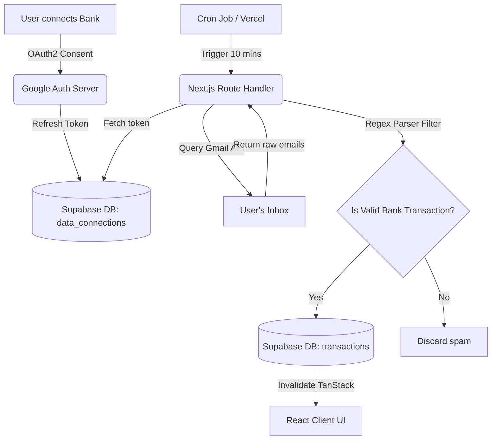

<div align="center">
  
  <h1 style="font-weight: 800; border-bottom: none;">Pesse Finance</h1>
  <p><b>Next-Generation Automated Personal Finance Tracker</b></p>
  
  <p>
    
    
    
    
  </p>
</div>

<br />

## 🌟 Tầm nhìn dự án (Overview)

**Pesse Finance** không chỉ là một ứng dụng ghi chép thu chi thông thường. Nắm bắt được điểm yếu đau đầu nhất của người dùng là "rất lười nhập tay thủ công từng giao dịch", Pesse Finance đem đến sự đột phá bằng công nghệ **Đồng bộ Tự Động (Auto-Sync) 100%**. 

Dưới tư duy kỹ thuật nền tảng xoay quanh **Serverless Cron Jobs** kết hợp **Google API (OAuth 2.0)**, Pesse Finance trực tiếp dò tìm và bóc tách các email "Biến động số dư" từ các hệ thống ngân hàng lớn, sau đó tự động phân loại, tính toán, và chuyển hóa chúng thành các báo cáo tài chính tuyệt đẹp chuẩn phong cách **Neumorphism**. 

Dự án nhấn mạnh vào một kiến trúc (Architecture) chặt chẽ, tối ưu hiệu năng băng thông và đảm bảo tính nguyên vẹn (ACID) của dữ liệu dưới cấp độ Production.

## ✨ Tính năng nổi bật chuyên sâu (Key Features)

- **Gmail API Bank Synchronization**: Luồng xác thực Google OAuth (Offline Access Type) siêu bảo mật, cấp *refresh_token* độc quyền để giao tiếp ngầm. Hỗ trợ hệ thống Regex linh hoạt có khả năng parse chính xác hóa đơn/biến động số dư từ Vietcombank, Techcombank, TPBank, MB Bank, và ACB.
- **Pesse AI Advisor (Gemini Integration)**: Tích hợp trí tuệ nhân tạo (Google Gemini API) để phân tích hành vi chi tiêu theo thời gian thực. AI không chỉ tóm tắt con số mà còn đưa ra những lời khuyên tài chính cá nhân hóa, giúp người dùng đạt được mục tiêu tiết kiệm nhanh hơn.
- **Serverless Automation Architecture**: Các luồng trích xuất dữ liệu hoàn toàn tự hoạt động ngầm thông qua Vercel Cron Jobs, vượt rào bảo mật RLS bằng `Service_Role` token một cách khát khe. Đảm bảo dữ liệu luôn được "làm tươi" mà không cần người dùng can thiệp.
- **Optimized Server/Client Architecture**: Áp dụng mô hình tách biệt **Server Components** (phục vụ SEO, Metadata chuẩn hóa) và **Client Components** (xử lý logic tương tác phức tạp). Điều này giúp ứng dụng có tốc độ load trang cực nhanh đồng thời duy trì khả năng tương tác mượt mà.
- **Global State Optimization**: Thiết kế chuẩn mực với `Zustand` phục vụ Client-side UI Interactions và mô hình `TanStack (React) Query` thao túng bộ nhớ đệm (caching), invalidation cho API layer - giải quyết triệt để tình trạng Waterfall Fetching.
- **Premium Neumorphic Data Visualization**: Kế thừa những phong cách UX/UI thời thượng với `Framer Motion` animations & `Recharts`. Biểu đồ logic động xử lý mượt mà toán học: So sánh thu nhập giữa các tháng, đo lường tỷ trọng danh mục chi tiêu, và xử lý Edge Cases thông minh (ví dụ: nhóm thiểu số dữ liệu rác thành category 'Khác').
- **Supabase PostgreSQL & Auth**: Quản lý dữ liệu phân tán chuẩn Relational Database. Tích hợp Social Authentication đa chiều (Google, Facebook).

## 🛠 Tech Stack

### Frontend Architecture
- **Framework**: `Next.js 14/15+` (App Router thuần túy)
- **Styling**: `Tailwind CSS` kết hợp design system kiểu `Neumorphism` (Glass/Plastic blend).
- **Data Fetching/Caching**: `@tanstack/react-query`
- **Client State**: `Zustand`
- **Charts / Motion**: `Recharts`, `Framer Motion`, `Lucide React`

### Backend & Database (BaaS)
- **Database Architecture**: `PostgreSQL` (Supabase BaaS)
- **Authentication**: `Supabase Auth` (OAuth2 & Row Level Security policies)
- **Automated Workers**: `Next.js Route Handlers` + `Vercel Cron Jobs`
- **Integrations**: `googleapis` (đọc dữ liệu biên lai gốc).

## 🏗 System Architecture Flow


## 🚀 Hướng dẫn khởi chạy Local Development

1. **Clone repository:**
   ```bash
   git clone https://github.com/Leizjx/Pesse-Finance.git
   cd pesse-app
   ```

2. **Cài đặt thư viện:**
   ```bash
   npm install
   ```

3. **Cấu hình Môi trường (Environment Variables):**
   Tạo file `.env.local` ở thư mục gốc và cấu hình đầy đủ các biến sau (cũng cần thêm các biến này vào Vercel Dashboard khi deploy):
   ```env
   # Supabase
   NEXT_PUBLIC_SUPABASE_URL=your_supabase_url
   NEXT_PUBLIC_SUPABASE_ANON_KEY=your_anon_key
   SUPABASE_SERVICE_ROLE_KEY=your_service_role_key

   # Google Auth & Gmail API
   NEXT_PUBLIC_GOOGLE_CLIENT_ID=your_google_client
   GOOGLE_CLIENT_SECRET=your_google_secret
   GOOGLE_REDIRECT_URI=http://localhost:3000/auth/callback

   # AI Advisor (Gemini)
   GEMINI_API_KEY=your_gemini_api_key

   # Deployment & Security
   NEXT_PUBLIC_APP_URL=http://localhost:3000
   CRON_SECRET=your_random_string_for_cron
   ```

4. **Khởi động Development Server:**
   ```bash
   npm run dev
   ```
   *Mở `http://localhost:3000` để bắt đầu trải nghiệm hệ thống.*

---
> Xin trân trọng cảm ơn các nhà thầu / tuyển dụng đã ghé thăm dự án! Pesse Finance là minh chứng cho sự am hiểu vững dòng chảy dữ liệu (Data Flow), tư duy phân tích hệ thống (System Design) và nghệ thuật bố trí Frontend (UI/UX Engineering).
